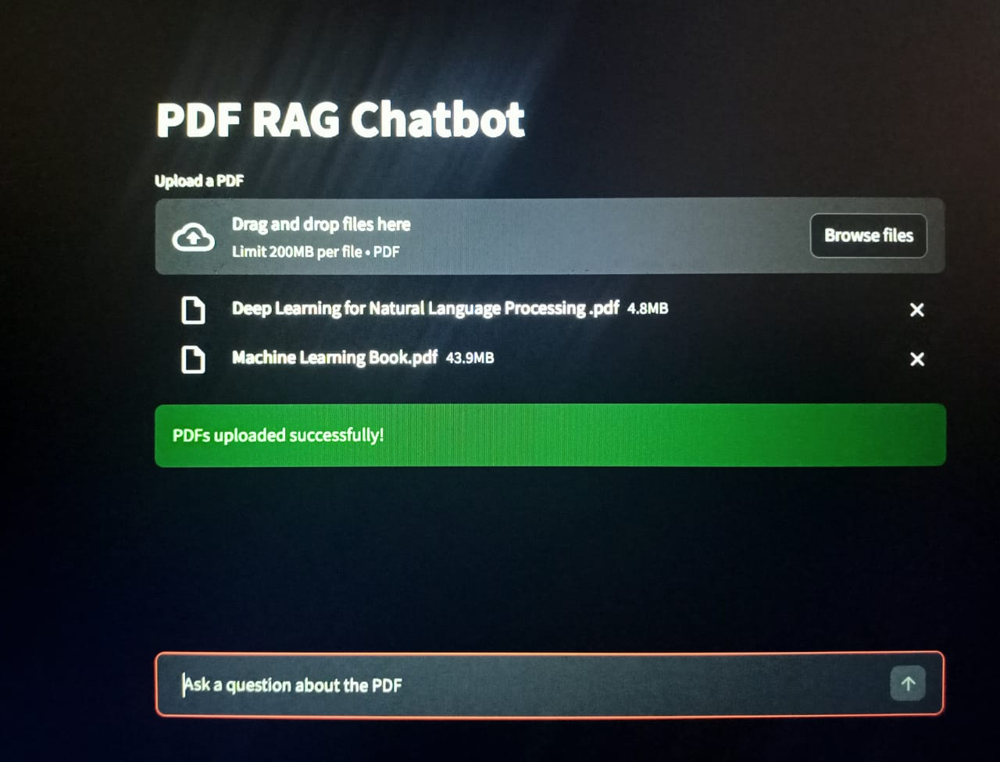

# PDF RAG Chatbot

A Retrieval-Augmented Generation chatbot that answers questions from uploaded PDFs.

## User Interface

## System Architecture

User uploads PDFs
      ↓
PDF Loader (PyMuPDF)
      ↓
Document Chunking
(RecursiveCharacterTextSplitter)
      ↓
Embeddings Generation
(HuggingFace Sentence Transformers)
      ↓
Vector Storage
(FAISS Vector Database)
      ↓
User Query
      ↓
Retriever (FAISS similarity search)
      ↓
Relevant Document Chunks
      ↓
Prompt Construction (Question + Context)
      ↓
LLM (Ollama - Phi3)
      ↓
Answer + Source Pages

## Features
- Multi-PDF support
- FAISS vector database
- HuggingFace embeddings
- Ollama LLM
- Source citation

## Tech Stack
- Python
- Streamlit
- LangChain
- FAISS
- Ollama

## How to Run

pip install -r requirements.txt
streamlit run app.py
